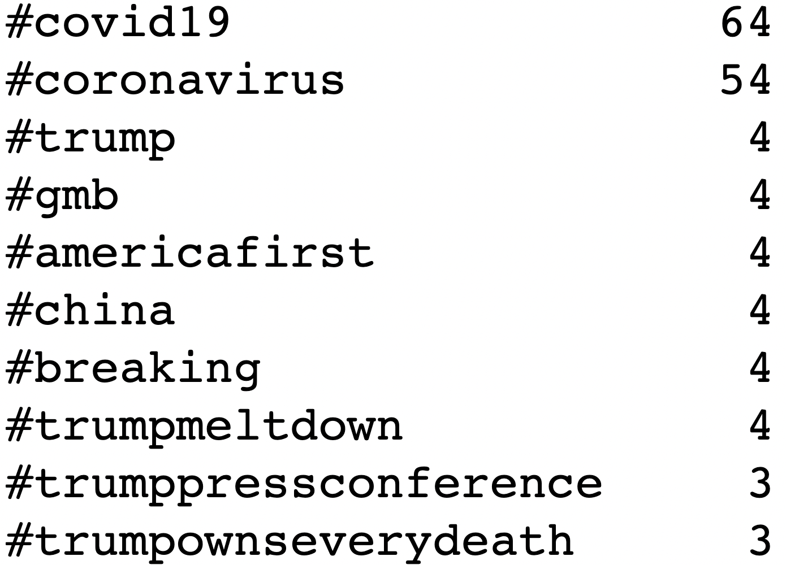

# Rumour-Detection-and-Analysis-on-Twitter


##### Table of Contents  
1. [Problem and Data](#problem-address)  
2. [Approaches](#Approaches)  
   1. [Classic Machine Learning](#1.-Classic-Approach) 
   2. [Transformer And Neural Model](#2.-Transformer-+-Neural-Approach) 
3. [Model Performance](#Model-Performance)  
4. [Evluation and Critical Analysis](#Evluation-and-Critical-Analysis)  
5. [What Are Rumour Like? Rumour Analysis](#What-Are-Rumour-Like?-Rumour-Analysis)  
   1. [Trending HashTag Analysis](#Trending-HashTag-Analysis)
   2. [Trending Topic Analysis](#Trending-Topic-Analysis)
   3. [Sentiment Analysis](#3Sentiment-Analysis)
6. [Conclusion](#conclusion)  
7. [Potential Issues](#potential-issues)  

### Kaggle Competition
This project is also involved in a kaggle competition involving 400+ students.

Our model achieves 3rd position in BOTH public and private leaderboard.

[Competition Link](https://www.kaggle.com/competitions/rumour-detection-and-analysis-on-twitter/leaderboard?)

---

## Problem Address

As the Covid-19 pandemic unfolded, citizens and
organizations of many countries took to social
networking platforms to spread their knowledge
surrounding the phenomenon.

Some of this knowledge was based on substantiated
facts such as data from government sources like
the World Health Organization. However there was
also a large number of tweets making statements
that were based on hearsay, or personal opinion
presented as fact.

These statements, commonly referred to as
“rumours” are an important class of social media
objects to understand, as they could range
from harmless assertions, to potentially deadly
recommendations.

This project details processing and classifier training
on a set of ‘tweets’ from the popular online
platform ‘Twitter’. The project is divided into two part:

1. identifying tweets and
2. analyse rumours

## Data

- a text file containing IDs of COVID-19 Related Tweets and IDs of their replies.
- a ground truth file containing IDs of Rumour and Non-Rumour Tweets.
- Total Number of Tweets Around ~30K.
  
---

## Approaches
Two approaches have been used in this project, purely based on linguistic features vs based on other attribute features.
1. NLP approach:
    Use words and sentences to do the predicition

2. Meta Data approach
    Use traditional attributes to do the prediction

## 1. Classic Approach

### Preprocessing

- Get full tweets of provided IDs using **Twitter API** V1.1 and V2.
- Group the IDs of replies and their source IDs.
- Get data for their authors. 
  
  

- Gather their label (0: non-rumour, 1: rumour)
- Keep attributes and transform text data into machine readable structure:
    1. Use Lemmatization to lemmatize the world ``` going->go, went->go```
    2. Divide sentences into words tokens.
    3. convert tokens into Bag of Word vector (count the occurance of each word and put it into a vector)

        


#### Final Data


### Machine Learning Models

1. Logistic Regression (LR)
2. Support Vector Classifier (SVC)
3. Multilayer Perceptron (MLP)
4. Long Short Term Memory Recurrent Neural Network (LSTM)

However, after doing classifications based on either bag of words or meta data (author information), the algorithm doesn't perform that well (around 0.7 accuracy).

## 2. Transformer + Neural Approach

### Preprocessing

- Get full tweets of provided IDs using **Twitter API** V1.1 and V2.
- Group the IDs of replies and their source IDs.
- Sort the replies based on their publish time.
- Gather their label (0: non-rumour, 1: rumour)
- Keep text data only.

#### Final Data


### Machine Learning Models

1. Bidirectional Encoder Representations from Transformers (BERT)
2. Multilayer Perceptron Classifer (After BERT)
   
#### BERT Explanation
- We use a bertweet-base model from hugging face. The model is trained on a huge tweet database(6B word tokens ~ 80GB data).

BERT is a transformer model that used NOT on classification tasks, but on extracting information/attribute from a sentence or document.
Bidirectional model means to capture the context of the text while the Encoder part means by extracting latent information from the text, the transformer output a contextual embedding layer representing the meaning of the whole sentence. (Like archive a file from file.txt -> file.zip)

 

With empirical experiments conducted by other researchers, it seems like the more abstraction (transformation) we have, the better the embedding captures the whole contextual information.

Additionally, with the output from the encoder, we have a embedding layer representing the meaning of the whole sentence ready to use.

By adding a classification layer right afther the embedding layer, we can output an actual label.


## Model Performance

AFter running a bunch of tests, the performance comparison among models are shown in figure below

 

BERT is currently state of the art in this project. 

---

## Evluation and Critical Analysis

### Evaluation

Intuitively, to measure the performance of the mode, we might have used vanilla "accuracy" metric.

Which is simply calculate the division between number of correct predictions and all data rows.

$$ Accuracy = {TP+TN \over TP+FP+TN+FN} $$

However, it would cause some problems given we have an extremely unbalanced dataset with non-rumour tweets 4 times more than rumour tweets.

Therefore, we used a better evaluation metric using F-beta Score, with beta set to 2.

$$ F_\beta = {(1+\beta^2) \times { Precision \times Recall \over \beta^2 \times Precision + Recall }} $$

From the formula, it can be seen that higher beta leads to higher proportion of "Recall" in our metric. F-1 score is just when beta = 1, precision and recall weights the same.

Briefly mentioning, "Recall" measures how many underlying "rumours" have been identified. "Precision" measure the quality of how many guesses made to identify the rumour.

Since most tweets are non-rumour, if we have a machine learning model simply output label "non-rumour", we can still get a high accuracy. But the model learnt nothing and it would be useless.

Therefore, we adopt f-beta metric with beta = 2 to make sure our model predict rumours as expected.

Additionally, we use Macro Averaging rather than weighted averaging to address the importqance of our minority label. More information about Macro vs Weighted can be found [here](https://stackoverflow.com/questions/55740220/macro-vs-micro-vs-weighted-vs-samples-f1-score#:~:text=average%3Dmacro%20says%20the%20function,each%20label%20in%20the%20dataset.)

### Critical Analysis
And it seems like the traditional models doesn't perform well on the validation set and the test data set.

To further Address the issue, we analyse the model from the essence and generate a "unseen word" problem plot.
```
    - The model is trained on bag of words vectors.
    - If a word is not seen in the training set, the model could not capture its contained information.
    - If too many words not occured in the model, the performance surely goes down.
```
 

---

## What Are Rumour Like? Rumour Analysis

### 1. Trending HashTag Analysis

NonRumour Hashtags       |  Rumour Hashtags
:-------------------------:|:-------------------------:
   |   

“What kind of hashtags are used by rumour and nonrumour tweets, and what is the overlap/difference between them?” 

As hashtags are used to spread tweets that share a common
theme, examining them gives us insight into what
sort of things are being expressed by rumour and
nonrumour tweeters. The hashtags are extracted
using regex, lowercased, and counted. 

As is visible from the Figure, the hashtags tweeted in rumours
and nonrumours are quite similar, but do have
some differences in content. The rumour hashtags
contain more references to former American
president Donald Trump, whereas the nonrumours
have #stayhome and #stayhomesavelives. This
suggests rumour tweet’s topics are more often
related to Donald Trump, and nonrumour tweet’s
topics are more often related to preventing covid
spread. 

A similar result is observed later in the
topic analysis section. 

One other point of note is that while the nonrumour class has only 7 times as
many tweets as the rumour class, the nonrumour
tweets contain over 25 times as many #covid19
instances compared to the rumour tweets. 
A similar situation occurs with #coronavirus. 

This suggests that nonrumour tweets contain more references to
the actual virus than rumours, although the reason
as to why this is the case is unclear


### 2. Trending Topic Analysis


NonRumour Topics       |  Rumour Topics
:-------------------------:|:-------------------------:
   |   


As the above figure suggested, rumours are more
often concerned with former American president
Donald Trump, and nonrumours contain topics like
the vaccine and masks. There is also some overlap,
as both Topic 3s seem to be about the number of
new cases.


The topic trending for rumour vs non rumour was extracted using Latent Drichlet Allocation (LDA) techniques.

LDA is a generative statistical model that allows sets of observations to be explained by unobserved groups that explain why some parts of the data are similar. For example, documents are represented as a mixture of topics and a topic is a bunch of words. Those topics reside within a hidden, also known as a latent layer, and the algorithm is meant to extract this information.

### 3. Sentiment Analysis

#### Sentiment Overview

 

The general sentiment of COVID-19 rumours is
negative, but rumours are on average more negative
than nonrumours.

We assign -1 to mean a negative sentiment,
and +1 to be positive sentiment. 

Applying the central limit theorem we can assume the data
follows a normal distribution, and after doing some
calculations, the results are shown below.

#### Sentiment Analysis result

 

- Model used: pre-trained transformer model on tweets data from January 2018 to December 2021 with the COVID-19 pandemic period data covered (cardiffnlp, 2022). 

From the second Table, the source of the rumour tweets tend
to deliver negative sentiment related information
(-0.480) and they receive more negative public
replies (-0.594). Unfortunately, our analysis can’t
determine the reason for more negative replies on
rumour tweets. For example, it could be that the
rumour tweets incite hatred in the general public,
or it could be the general public criticising the
rumours.

The general negative sentiment of both classes
is understandable. Most of the topics discussed in
tweets concern things such as the number of deaths
and various lock-downs, so it is reasonable that the
general sentiments are towards negative aspects.

## Conclusion
- Machine Learning is all about preprocessing and feature engineering, with powerful transformer BERT to extract features, it completely beats the classical bag of words feature. 
- Transformer BERT can capture the underlying meanings of the whole sentences while frequency counting method like bag of words can only capture the count pattern.
- Rumours generally deliver more negative sentiments towards the general public than non-rumours.
- Rumours Identification may not purely on author's information as the classifier doesn't perform that well.
- No geo related information has been analysed due to the nature that we only keep tweets in English.
- The Non-Rumour tweets might deliver useful informations such as vaccinations, masks to the general public.

## Potential Issues

1. Some tweets have been taken down / deleted so we can not get all data to work on.
2. Our prediction Model sizes around 1.5GB, so it can not be saved and have to be retrained.

## Other information

```

#### Kaggle: 
Link: https://www.kaggle.com/competitions/rumour-detection-and-analysis-on-twitter/leaderboard?

#### Report:
Link: https://www.overleaf.com/read/bbxchdzbpvtv

#### File Structure:

You will want to extract several compressed file to its current location, for example: extract /full_data/data_storage/full_dev_train.zip  to its current location  /full_data/data_storage/full_dev_train.json

##### Task1: Rumour Classification Problems using BERT
./task1_BERT/*
BERT model used on Google Colab platform, with batch size tuning to 20, number of epochs to 15, and hidden dropout prob set to 0.1, using train+dev set to train, with truncated tweets used (yeah it outperforms using full text tweets) we get our best submission results.
./task1_BERT/bert_data/*
data used to train bert model

##### Task2: Analysis rumour tweets structures
./task2_Analysis/Predict.ipynb Predict the label using the model (the prediction part is in fact done on Google Colab, this notebook just concatenate the result)
other files: Topic, Hashtag and sentiment analysis


#### ./deprecated/* method tried before applying final BERT model

##### 1. ./tweetgetter:
./deprecated/tweetgetter/* Twitter APIs and Crawlers used through out the project, get twitter data by their IDs etc
./deprecated/Deprecated_Crawler/* Functional crawler but hasn't been used throughout the project
TwitterGetter.ipynb    # Scrap twitter data and Scrap twitter author data
TwitterGetter_V2.ipynb    # Scrap twitter data including author data for whole Train + Dev Set, however, this method WILL return text that may be truncated!!!
Analysis.ipynb    # analyse the twitter data

##### 2. Classic Models
./deprecated/models  previously tried models, including ClassicModel: MLP, SVC, LR and preprocessings such as PCA, TFIDF, bag of words etc. It also includes a deprecated BERT model which is trained on my GPU, however, the GPU memory restricted the training batch size, so later we move to GoogleColab cloud platform.
./deprecated/preprocessing_evalluations  bunch of relevant codes doing preprocessing and evaluations, trying to get original tweet data to "Source_Text" + List of "Reply_Text"

##### 3. ./data:
./data/* data needed to run the code, note that the path to these data need to be modified before any running and testing.
./id_data/     # stores Twitter IDs
./full_data/storage_data    # stores scrapped data , full data set for twitter and author
./full_data/*.json   # these file are generated by run-time program and can be changed so it's a temporary location
```
